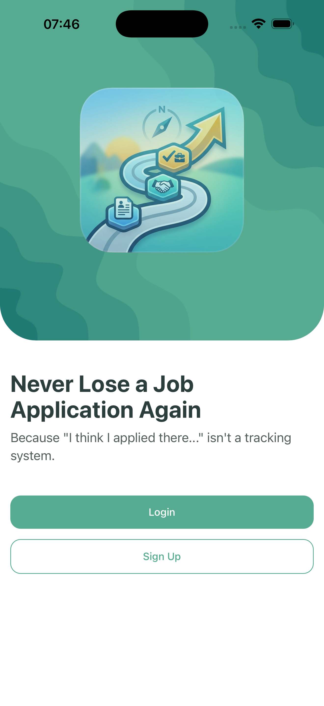
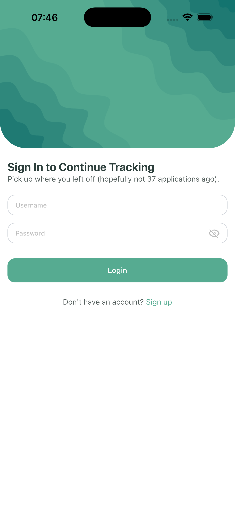
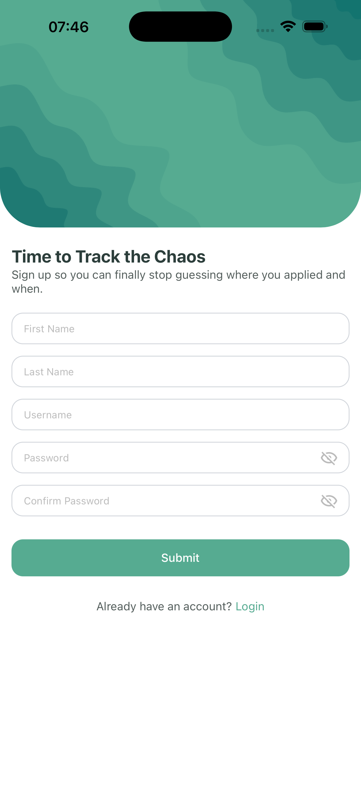
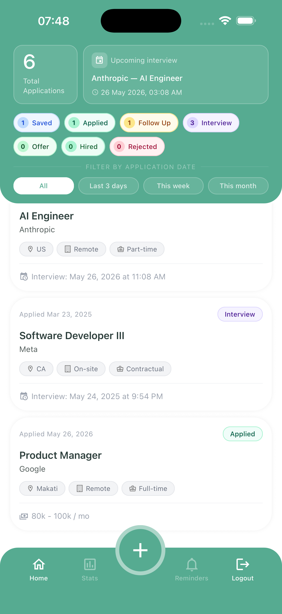
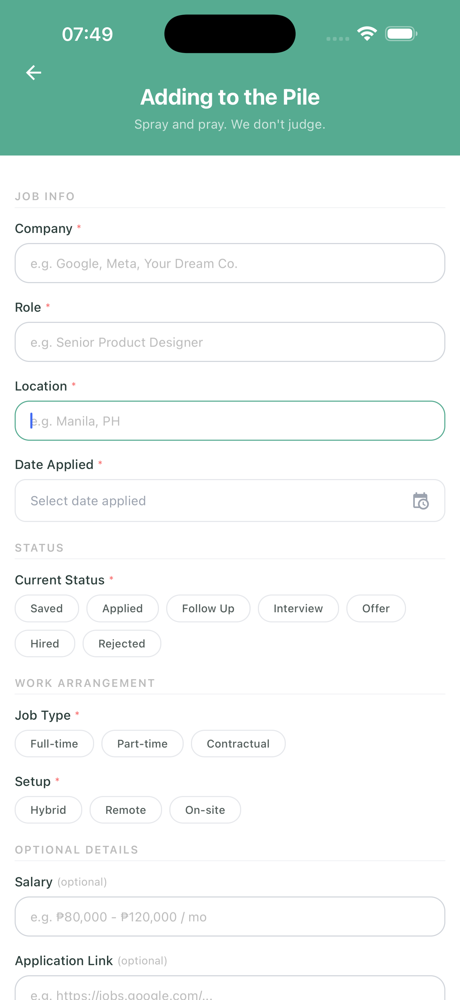
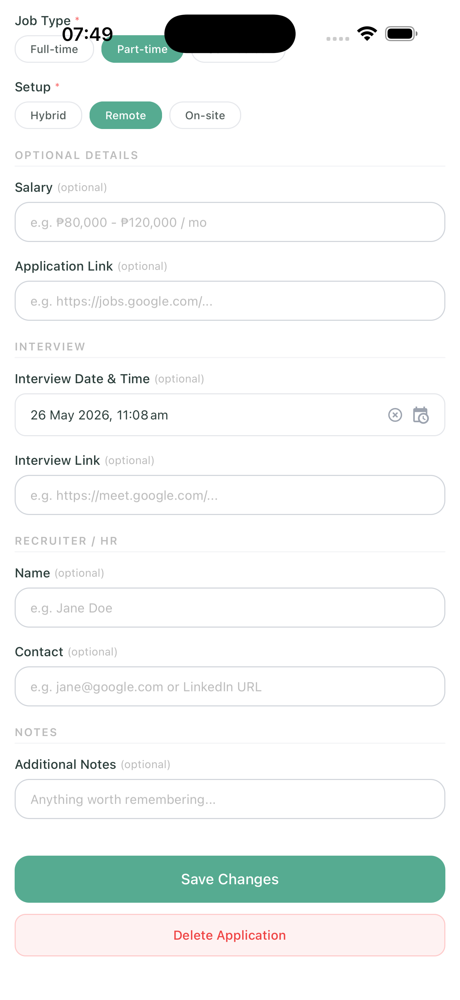

# JobTrail

A job application tracker built for the hustle. Log every application, track your status, and never lose track of where you applied — because in this economy, you need all the help you can get.

---

## Screenshots

<p align="center">
  
  
  
</p>
<p align="center">
  <sub>Welcome &nbsp;&nbsp;&nbsp;&nbsp;&nbsp; Login &nbsp;&nbsp;&nbsp;&nbsp;&nbsp; Sign Up</sub>
</p>

<p align="center">
  
  
  
</p>
<p align="center">
  <sub>Dashboard &nbsp;&nbsp;&nbsp;&nbsp;&nbsp; Add Application &nbsp;&nbsp;&nbsp;&nbsp;&nbsp; Edit Application</sub>
</p>

---

## Tech Stack

**Mobile**
- React Native CLI
- TypeScript
- NativeWind (Tailwind for RN)
- TanStack Query
- React Hook Form
- Axios
- Notifee (local notifications)
- Day.js
- Jest (unit testing)

**Backend**
- Node.js + Express
- MongoDB + Mongoose
- JWT Authentication
- Railway (hosted)

---

## Features

- Register and log in securely
- Add, edit, and delete job applications
- Track status: Saved, Applied, Follow Up, Interview, Offer, Hired, Rejected
- Filter by status and application date
- Dashboard with live stats per status
- Interview reminders via local notifications (10s, 30s, 1min, and exact time)
- Motivational nudges when you need them most

---
## Usage

### Option A — Use the test account
Log in with the following credentials:

```
Username: test
Password: 12345678
```

### Option B — Create your own account
1. Open the app
2. Tap **Sign Up** on the welcome screen
3. Fill in your details and register
4. Log in with your new credentials

### Using the app
- Tap the **+** button to add a new job application
- Fill in the required fields (company, role, location, date applied, status, job type, setup)
- Optional fields include salary, application link, interview schedule, recruiter details, and notes
- Tap a job card to edit or delete it
- Use the **status chips** on the dashboard to filter by application status
- Use the **date filters** to narrow down by when you applied
- If an interview is scheduled, local notifications will fire as reminders

---

## Project Structure

```
JobTrail/
├── api/          # Express backend
└── src/          # React Native app
```

---

## Getting Started

### Prerequisites

- Node.js `>= 22.11.0`
- Yarn
- Android Studio (for Android) or Xcode (for iOS, macOS only)
- MongoDB (only if running the API locally)

---

### 1. Clone the repo

```bash
git clone https://github.com/russhenson/JobTrail.git
cd JobTrail
```

---

### 2. Environment Variables

Only the API requires an `.env` file.

📁 Download from Google Drive: **[JobTrail Docs](https://drive.google.com/drive/folders/1AwxIuZwmUhH5GzvmlbcT7PGBSVePMKzb?usp=sharing)**

Download `env.txt` and rename it to `.env`, then place it in the `api/` directory.

> The mobile app does not require an `.env` file.
> In development (`__DEV__`), it points to your local API.
> In release builds, it points to the deployed Railway API automatically.

---

### 3. Install dependencies

```bash
# Mobile
yarn install
yarn ios:install   # iOS only — installs CocoaPods

# API
cd api && yarn install
```

---

### 4. Run the API

#### Option A — Use the deployed API (recommended)
Already live at: https://jobtrail-production-f242.up.railway.app

No setup needed. Release builds hit this automatically.

#### Option B — Run locally
```bash
cd api
yarn dev
```

> Make sure MongoDB is running and `api/.env` is in place.
> The mobile app in `__DEV__` mode will point to `localhost:5050` automatically.

---

### 5. Run the app

#### Android
```bash
yarn android
```

#### iOS
```bash
yarn ios
```

> ⚠️ `yarn ios` requires macOS with Xcode installed. It **cannot** be run on Windows.
> The Expo Go app **cannot** be used — this project uses React Native CLI.

---

### 6. Run tests

```bash
yarn test
```

---

## Installing the App

### Android APK

📁 Download the APK from Google Drive: **[JobTrail Docs](https://drive.google.com/drive/folders/1AwxIuZwmUhH5GzvmlbcT7PGBSVePMKzb?usp=sharing)**

Enable **Install from Unknown Sources** on your Android device before installing.

To build the APK yourself:
```bash
cd android
./gradlew assembleRelease
```

Output: `android/app/build/outputs/apk/release/app-release.apk`

### iOS

> ⚠️ TestFlight distribution requires an active Apple Developer account.
> An iOS build cannot be provided without one.
>
> To run on iOS, clone the repo and run `yarn ios` on a macOS machine with Xcode installed.

---

## API Endpoints

Base URL: `https://jobtrail-production-f242.up.railway.app`

| Method | Endpoint | Description |
|--------|----------|-------------|
| POST | `/auth/register` | Register a new user |
| POST | `/auth/login` | Login |
| GET | `/jobs` | Get paginated jobs (`?status=` `?dateFilter=`) |
| GET | `/jobs/dashboard` | Get dashboard stats |
| POST | `/jobs` | Create a job application |
| PUT | `/jobs/:id` | Update a job application |
| DELETE | `/jobs/:id` | Delete a job application |

---

## Notes

- API is hosted on Railway — first request may have a short cold start delay
- Notifications are local only and do not persist across reinstalls (demo purposes)
- iOS notification permission prompt appears on first launch